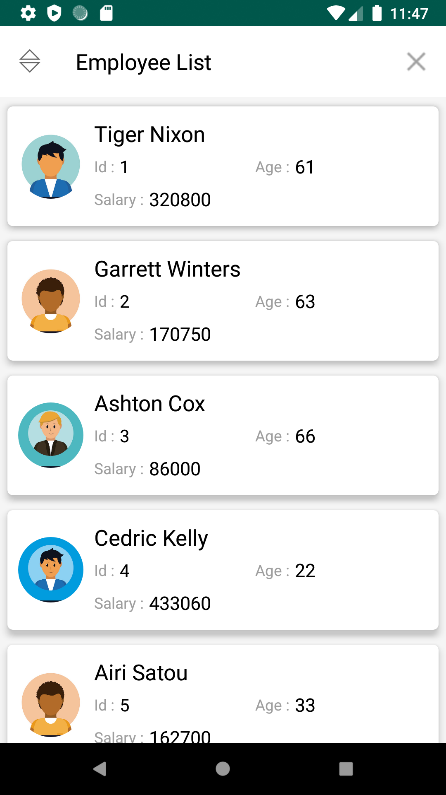
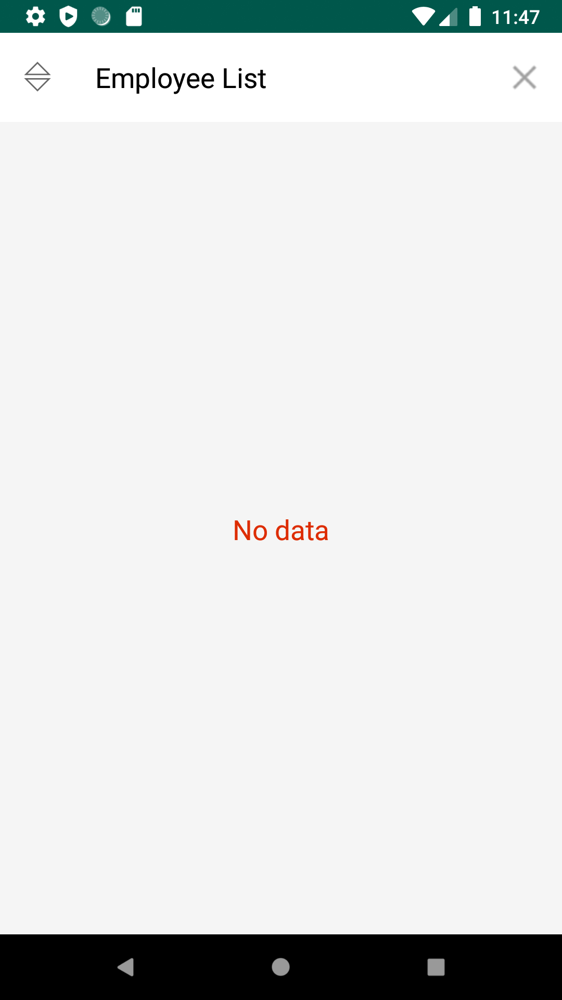
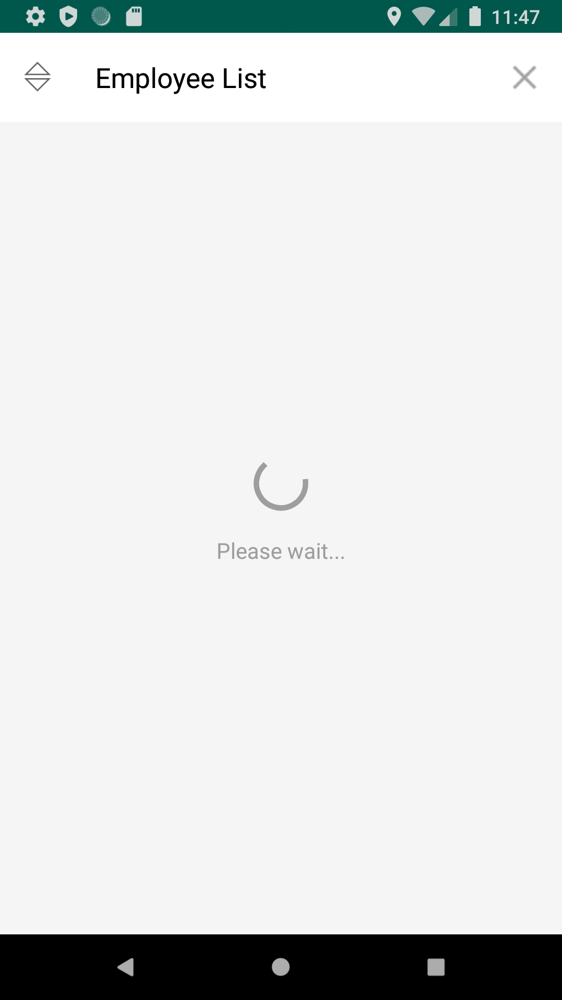
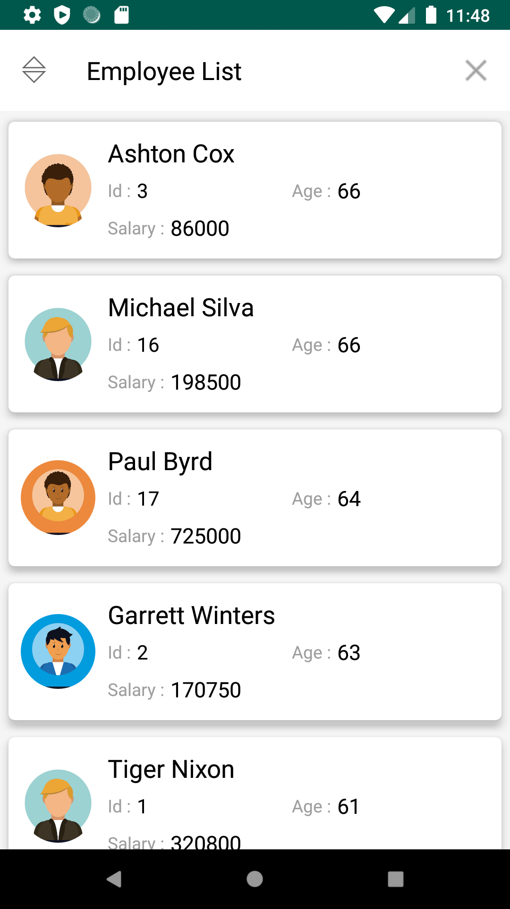

# Employee List Application
# What does this app do?
This Android application displays the list of employees from an API endpoint using a networking library 'retrofit'. The list can be also sorted by age of the employee or completely cleared.
These employee data are stored in local SQLite DB. The sorting and clear actions are performed by direct SQLite DB queries.

# Screenshots

# Tasks Done

- [x] Start a project with blank activity, choose minimum SDK of your choice.
- [x] Make a GET: http://dummy.restapiexample.com/api/v1/ and retrive response (Choose client library of your choice, retrofit or volley is preferred)
- [x] Populate the local SQLite DB, so that you don't make a call to end point again.
- [x] Create a pleasing layout, which lists the details from SQLite DB. Something similar to the image below (not attached). Response don't have profile image url, so randomize the profile image with local assets or populate profile image using first and last name.
- [x] Have controls to purge the SQLite DB, purging SQLite should reflect ui. Next time the user opens the activity, SQLite should be populated and reflected in the ui.
- [x] Have controls to sort lists based on the age of the user.
- [x] Once done upload it to git and create a README, along with screenshots and include debug apk in git.

# Pending Great to do

- [ ] Skeleton for list while loading data from SQLite.
- [ ] Swipe right or left to remove item from SQLite.
- [ ] Pull down to refresh the list the list of items from the upstream endpoint.
- [ ] Long press on the item, to share the details using Intent.
- [ ] Distribute app through app/play store, if you hold a developer licence.
